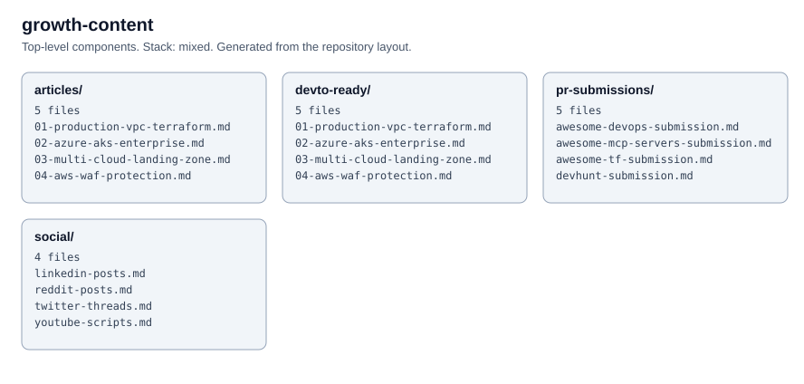

# Growth Content

Articles and a promotion plan for the open source repositories in this account.

- `articles/`: article drafts in Markdown
- `content-calendar.md`: an eight-week posting schedule
- `deployment-guide.md`: the free promotion channels and which steps are automated or manual

<!-- project-structure -->
## Project structure

```text
├── articles/
│   ├── 01-production-vpc-terraform.md
│   ├── 02-azure-aks-enterprise.md
│   ├── 03-multi-cloud-landing-zone.md
│   ├── 04-aws-waf-protection.md
│   └── 05-mcp-servers-guide.md
├── devto-ready/
│   ├── 01-production-vpc-terraform.md
│   ├── 02-azure-aks-enterprise.md
│   ├── 03-multi-cloud-landing-zone.md
│   ├── 04-aws-waf-protection.md
│   └── 05-mcp-servers-guide.md
├── pr-submissions/
│   ├── awesome-devops-submission.md
│   ├── awesome-mcp-servers-submission.md
│   ├── awesome-tf-submission.md
│   ├── devhunt-submission.md
│   └── mcp-directory-submissions.md
├── social/
│   ├── linkedin-posts.md
│   ├── reddit-posts.md
│   ├── twitter-threads.md
│   └── youtube-scripts.md
├── .editorconfig
├── .gitattributes
├── .gitignore
├── CODEOWNERS
├── CONTRIBUTING.md
├── LICENSE
├── README.md
├── SECURITY.md
├── content-calendar.md
└── deployment-guide.md
```

<!-- architecture -->
## Architecture


